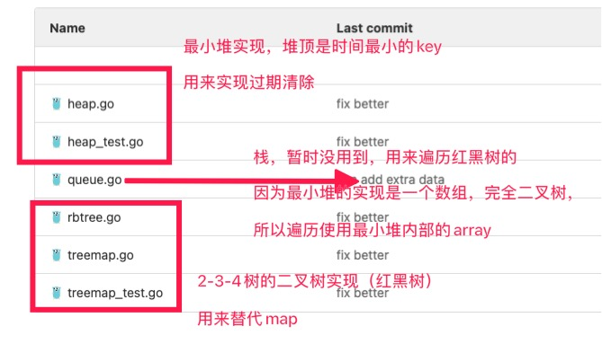

# Golang实现的能自动回收过期值的内存缓存库

[](https://github.com/hunterhug/gocache/network)
[](https://github.com/hunterhug/gocache/stargazers)
[](https://github.com/hunterhug/gocache)
[](https://github.com/hunterhug/gocache/issues)

[English README](README.md)

该库使用了红黑树和最小堆数据结构。利用最小堆堆顶是最老的值，从而快速清洗过期值。可以认为是一个有过期时间的 `K-V` 本地内存数据库。

原理很简单:

1. 一个 `treeMap` 用来保存 `K-V`，一个最小堆的完全树用来清洗过期 `key`。
2. 官方的 `map` 不会缩容，`treemap` 的话不会占用多余空间。
3. 开了个定时器惰性删除过期key，由于定时器每秒最多清除30个过期，可能不够实时，所以当客户端主动拿值时会进行实时删除key，参考的redis。



数据保存在内存中，又快又好，这个内存缓存库非常高效，不需要预分配空间。

## 使用

直接执行:

```
go get -v github.com/hunterhug/gocache
```

## 例子

参考以下方法：

```go
type Cache interface {
    Set(key string, value []byte, expireTime time.Duration)
    SetInterface(key string, value interface{}, expireTime time.Duration)
    SetByExpireUnixNanosecondDateTime(key string, value []byte, expireUnixNanosecondDateTime int64)
    SetInterfaceByExpireUnixNanosecondDateTime(key string, value interface{}, expireUnixNanosecondDateTime int64)
    Delete(key string)
    Get(key string) (value []byte, expireUnixNanosecondDateTime int64, exist bool)
    GetInterface(key string) (value interface{}, expireUnixNanosecondDateTime int64, exist bool)
    GetOldestKey() (key string, expireUnixNanosecondDateTime int64, exist bool)
    Size() int
    Index(index int) (value []byte, expireUnixNanosecondDateTime int64, exist bool)
    IndexInterface(index int) (value interface{}, expireUnixNanosecondDateTime int64, exist bool)
    KeyList() []string
    ShutDown()
}
```

设置缓存时，可以选择使用 `time.Duration` 来设置过期时间，内部转化之后的时间是纳秒 `expireUnixNanosecondDateTime`。

例子：

```go
package main

import (
	"fmt"
	"github.com/hunterhug/gocache"
	"time"
)

func main() {
	cache := gocache.New()
	defer cache.ShutDown()

	cache.Set("a", []byte("a hi"), 2*time.Second)
	cache.Set("b", []byte("b hi"), 2*time.Second)
	cache.SetInterface("c", []byte("c hi"), 2*time.Second)

	fmt.Println(cache.Size())
	fmt.Println(cache.GetOldestKey())
	fmt.Println(cache.KeyList())
	fmt.Println(cache.Get("a"))
	fmt.Println(cache.GetInterface("c"))

	time.Sleep(2 * time.Second)
	fmt.Println(cache.Get("a"))
}
```

# License

```
Copyright [2019-2021] [github.com/hunterhug]

Licensed under the Apache License, Version 2.0 (the "License");
you may not use this file except in compliance with the License.
You may obtain a copy of the License at

    http://www.apache.org/licenses/LICENSE-2.0

Unless required by applicable law or agreed to in writing, software
distributed under the License is distributed on an "AS IS" BASIS,
WITHOUT WARRANTIES OR CONDITIONS OF ANY KIND, either express or implied.
See the License for the specific language governing permissions and
limitations under the License.
```